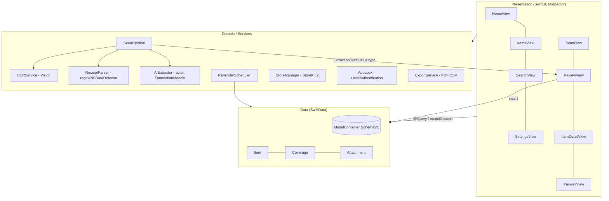
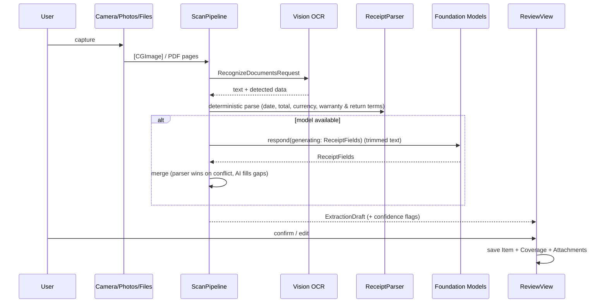
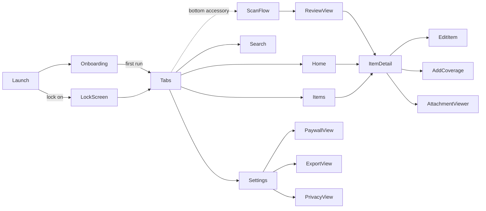

# Ownwise — Warranties, Returns & Service for Everything You Own (iOS 26+)

> **Build brief for Claude Code.** This README is the single source of truth. Build exactly what it says, phase by phase (§14). Private, offline, on-device. Ship v1.0 in 7 days.

---

## 0. Name & identity

| Field | Value |
|---|---|
| App name (App Store, ≤30) | **Ownwise: Warranty Tracker** |
| Subtitle (≤30) | `Receipts, returns & reminders` |
| Home-screen name | `Ownwise` |
| Bundle ID | `com.<yourteam>.ownwise` |
| Domain to check | `ownwise.app` (privacy/support pages) |
| Meaning | *own* + *wise* → "smart about what you own". Short, pronounceable in any language, no regional meaning |

**Name check done (Oct 2026, web search):** no App Store listing found for "Ownwise". Taken / too close (do NOT use): CoverKeep, Wardly, Wardy, ProofKeep, Proof Keep, Warantly, Warranto, KeepSlip, Kept, Keep Receipt, Wrnty, wrrnty, Warrantr, Ravely, MrReceipt, Warranty Wallet, WarrantyVault, Receipt Vault.
**Final check is authoritative only in App Store Connect → My Apps → + New App** (name reservation). Do it on Day 1 before coding.

## 1. Positioning (why this wins in a crowded category)

Generic "receipt + warranty vault" apps are saturated and most look dated or require accounts/cloud. Ownwise is the **ownership manager** for a global audience (US, UK, EU, Canada, Australia, Japan, India, Gulf):

1. **One timeline per item**: Return window → Manufacturer warranty → Extended warranty / protection plan → Service plan → Insurance. Competitors track only warranty expiry.
2. **Return-window alerts** ("3 days left to return") — the most frequent, money-saving deadline for US/EU shoppers.
3. **Recurring maintenance** (HVAC filter every 3 months, water filter every 6, car service yearly) — not just one-off expiry.
4. **Claim-ready in 10 seconds**: one screen with receipt, serial, purchase date, coverage left, support contact; export a "Claim Pack" PDF.
5. **Smart scan in 40+ languages**, any currency, any tax format (VAT, GST, sales tax) — 100% on-device: Vision OCR + Apple Foundation Models. No account, no server, no analytics. Privacy label: *Data Not Collected*.
6. **Liquid Glass native** design, SF fonts, Apple system colors — looks like Apple built it.

Monetization: **Free up to 8 items. Ownwise Pro = one-time non-consumable**, US price tier $4.99 (App Store auto-localizes prices for every storefront): unlimited items, service plans, Claim Pack PDF, CSV export, app lock. No subscription (zero server = zero recurring cost). Use App Store Connect price tiers; consider regional price adjustments for emerging markets.

## 2. Scope

### v1.0 (this week) — MUST
- Capture: document camera (multi-page), Photos, Files (PDF), manual entry.
- Smart extraction: OCR → deterministic parser → Foundation Models guided generation → **review screen** (user confirms).
- Items with coverages (Return window / Manufacturer / Extended / Service plan / Insurance) and attachments.
- Home dashboard: Return soon / Expiring soon / Service due / Covered / Expired.
- Local notifications: return window 3 / 1 day before; warranty 30 / 7 / 1 day before end; service due date.
- Localization-ready from day 1: String Catalog, `FormatStyle` for dates/currency, RTL-safe layouts. Ship v1 in English; add de, fr, es, ja, pt-BR in v1.1.
- Search (Tab role `.search`), sort, filter by category & status.
- Item detail with one-tap copy serial, call support number.
- Pro IAP (StoreKit 2), restore, paywall.
- App lock (Face ID), export item PDF + all-items CSV via ShareLink.
- Settings, onboarding (3 screens), privacy screen.

### v1.1+ — LATER (do not build now)
CloudKit sync · Widgets & Control · App Intents/Shortcuts · iOS 27 image-input extraction · iPad split view · Mac (Designed for iPad) · Android.

## 3. Platform & tech stack

| Area | Choice |
|---|---|
| Min deployment | **iOS 26.0** (iPhone only for v1) |
| Xcode / Swift | Xcode 26.x, **Swift 6 language mode** |
| Concurrency build settings | `SWIFT_DEFAULT_ACTOR_ISOLATION = MainActor`, `SWIFT_APPROACHABLE_CONCURRENCY = YES`, strict concurrency complete |
| UI | SwiftUI only (UIKit only for `VNDocumentCameraViewController` wrapper) |
| State | Observation (`@Observable`, `@State`, `@Environment`). **No** `ObservableObject`/Combine |
| Persistence | SwiftData + `VersionedSchema` from day 1, CloudKit-compatible models, sync off in v1 |
| OCR | Vision `RecognizeDocumentsRequest` (iOS 26) |
| AI | `FoundationModels` (`@Generable`, `@Guide`, `LanguageModelSession`) — optional path |
| Capture | VisionKit `VNDocumentCameraViewController`, `PhotosPicker`, `.fileImporter` |
| IAP | StoreKit 2 + `ProductView` |
| Notifications | `UserNotifications` (local only) + `BGAppRefreshTask` for rescheduling |
| Lock | `LocalAuthentication` |
| Tests | Swift Testing (`import Testing`), StoreKit configuration file |
| Dependencies | **None** (zero SPM packages = zero maintenance) |

### Availability rules
- Foundation Models: always check `SystemLanguageModel.default.availability`. If not `.available` (ineligible device, Apple Intelligence off, model downloading) → parser-only result + manual review. **App must be fully usable without AI.**
- Image attachments to the model are **iOS 27+ only** → v1.1, behind `if #available(iOS 27, *)`.
- Liquid Glass APIs are iOS 26 → no fallbacks needed (min target 26).

## 4. Architecture

Feature-first, layered, protocol-light. MVVM only where a view has real logic (`@Observable` model per feature); simple views query SwiftData directly with `@Query`.



### Scan pipeline



**Rules:** parser is baseline truth; AI only fills blanks/disambiguates; the user always confirms. Never auto-save AI output.

### Navigation



## 5. File organization

Use Xcode 16+ **folder-synchronized groups** (default for new projects) so files Claude creates on disk appear automatically.

```
Ownwise/
├─ App/
│  ├─ OwnwiseApp.swift            # @main, container, environment injection, BG task
│  ├─ RootView.swift               # onboarding / lock / tabs switch
│  └─ AppTabs.swift                # TabView (iOS 26 Tab API)
├─ DesignSystem/
│  ├─ Tokens.swift                 # spacing, radius, layout constants
│  ├─ Typography.swift             # text-style helpers (SF only)
│  ├─ Palette.swift                # semantic system colors
│  └─ Components/
│     ├─ GlassScanButton.swift
│     ├─ StatusBadge.swift
│     ├─ SectionCard.swift
│     ├─ ItemRow.swift
│     └─ EmptyStateView.swift
├─ Data/
│  ├─ Schema/SchemaV1.swift        # VersionedSchema + models
│  ├─ Schema/MigrationPlan.swift
│  ├─ Persistence.swift            # ModelContainer factory (+ preview/in-memory)
│  └─ Enums.swift                  # ItemCategory, CoverageKind, AttachmentKind, CoverageStatus
├─ Features/
│  ├─ Home/ HomeView.swift
│  ├─ Items/ ItemsView.swift, ItemDetailView.swift, EditItemView.swift, CoverageEditor.swift
│  ├─ Scan/ ScanFlow.swift, DocumentCamera.swift, ReviewView.swift, ReviewModel.swift
│  ├─ Search/ SearchView.swift
│  ├─ Settings/ SettingsView.swift, ExportView.swift, PrivacyView.swift
│  ├─ Paywall/ PaywallView.swift
│  └─ Onboarding/ OnboardingView.swift, LockScreen.swift
├─ Services/
│  ├─ Scan/ ScanPipeline.swift, OCRService.swift, ReceiptParser.swift, AIExtractor.swift, ExtractionDraft.swift
│  ├─ ReminderScheduler.swift
│  ├─ StoreManager.swift
│  ├─ AppLock.swift
│  └─ ExportService.swift
├─ Resources/
│  ├─ Assets.xcassets              # AppIcon (Icon Composer .icon), AccentColor
│  ├─ Localizable.xcstrings        # String Catalog (en; de, fr, es, ja, pt-BR in v1.1)
│  ├─ PrivacyInfo.xcprivacy
│  └─ Ownwise.storekit           # local StoreKit config
├─ OwnwiseTests/                   # unit (Swift Testing)
│  ├─ ReceiptParserTests.swift
│  ├─ CoverageStatusTests.swift
│  ├─ ReminderSchedulerTests.swift
│  ├─ StoreManagerTests.swift       # StoreKitTest SKTestSession: buy, restore, refund, free limit
│  ├─ ExportServiceTests.swift      # CSV escaping, PDF non-empty
│  └─ ScanPipelineTests.swift       # merge rules: parser wins, AI fills gaps (stub extractor)
└─ OwnwiseUITests/                 # end-to-end (XCTest + XCUIApplication)
   ├─ OnboardingFlowUITests.swift
   ├─ ManualAddFlowUITests.swift
   ├─ ScanReviewFlowUITests.swift
   ├─ SearchFilterUITests.swift
   ├─ PaywallFlowUITests.swift
   └─ Support/UITestLaunch.swift   # launch args + accessibility IDs
```

## 6. Data model (SwiftData, CloudKit-ready)

CloudKit rules applied now so sync is a toggle later: every property has a default or is optional, **no `@Attribute(.unique)`**, every relationship optional with an inverse. Enums stored as raw `String` (predicate-safe). Money stored as **minor units `Int`** (paise/cents) to avoid floating-point errors.

```swift
// Data/Schema/SchemaV1.swift
import SwiftData
import Foundation

enum SchemaV1: VersionedSchema {
    static let versionIdentifier = Schema.Version(1, 0, 0)
    static var models: [any PersistentModel.Type] { [Item.self, Coverage.self, Attachment.self] }

    @Model final class Item {
        var id: UUID = UUID()
        var name: String = ""
        var brand: String = ""
        var modelNumber: String = ""
        var serialNumber: String = ""
        var categoryRaw: String = ItemCategory.appliance.rawValue
        var purchaseDate: Date = Date.now
        var priceMinor: Int? = nil            // 1,299.50 -> 129950 (scale by currency's minor units; JPY = 0)
        var currencyCode: String = Locale.current.currency?.identifier ?? "USD"
        var merchant: String = ""
        var orderNumber: String = ""          // invoice / order / receipt no.
        var taxID: String = ""                // VAT / GST / ABN etc., optional
        var supportPhone: String = ""
        var notes: String = ""
        var createdAt: Date = Date.now
        @Relationship(deleteRule: .cascade, inverse: \Coverage.item) var coverages: [Coverage]? = []
        @Relationship(deleteRule: .cascade, inverse: \Attachment.item) var attachments: [Attachment]? = []

        var category: ItemCategory {
            get { ItemCategory(rawValue: categoryRaw) ?? .other }
            set { categoryRaw = newValue.rawValue }
        }
        init(name: String) { self.name = name }
    }

    @Model final class Coverage {
        var id: UUID = UUID()
        var kindRaw: String = CoverageKind.manufacturer.rawValue
        var provider: String = ""
        var startDate: Date = Date.now
        var endDate: Date = Date.now
        var serviceIntervalMonths: Int? = nil   // service-plan / maintenance cadence
        var lastServiceDate: Date? = nil
        var contact: String = ""
        var item: Item?

        var kind: CoverageKind {
            get { CoverageKind(rawValue: kindRaw) ?? .manufacturer }
            set { kindRaw = newValue.rawValue }
        }
        var nextServiceDate: Date? {
            guard let m = serviceIntervalMonths, m > 0 else { return nil }
            return Calendar.current.date(byAdding: .month, value: m, to: lastServiceDate ?? startDate)
        }
        init(kind: CoverageKind, start: Date, end: Date) { kindRaw = kind.rawValue; startDate = start; endDate = end }
    }

    @Model final class Attachment {
        var id: UUID = UUID()
        var kindRaw: String = AttachmentKind.receipt.rawValue
        @Attribute(.externalStorage) var fileData: Data? = nil   // JPEG (0.8) or PDF
        var contentType: String = "public.jpeg"
        var ocrText: String = ""                                 // searchable
        var createdAt: Date = Date.now
        var item: Item?
        init(kind: AttachmentKind, data: Data, contentType: String) {
            kindRaw = kind.rawValue; fileData = data; self.contentType = contentType
        }
    }
}

typealias Item = SchemaV1.Item
typealias Coverage = SchemaV1.Coverage
typealias Attachment = SchemaV1.Attachment
```

```swift
// Data/Enums.swift
enum ItemCategory: String, CaseIterable, Codable, Sendable { case appliance, electronics, mobile, computer, furniture, vehicle, other }
enum CoverageKind: String, CaseIterable, Codable, Sendable { case returnWindow, manufacturer, extended, servicePlan, insurance }
enum AttachmentKind: String, CaseIterable, Codable, Sendable { case receipt, invoice, warrantyCard, manual, photo }
enum CoverageStatus: Sendable { case active, expiringSoon(days: Int), expired, serviceDue }
```

```swift
// Data/Persistence.swift
import SwiftData

enum MigrationPlan: SchemaMigrationPlan {
    static var schemas: [any VersionedSchema.Type] { [SchemaV1.self] }
    static var stages: [MigrationStage] { [] }
}

enum Persistence {
    static func makeContainer(inMemory: Bool = false) -> ModelContainer {
        let schema = Schema(versionedSchema: SchemaV1.self)
        let config = ModelConfiguration(schema: schema,
                                        isStoredInMemoryOnly: inMemory,
                                        cloudKitDatabase: .none)   // v1.1: .automatic + fallback
        do { return try ModelContainer(for: schema, migrationPlan: MigrationPlan.self, configurations: config) }
        catch { fatalError("ModelContainer failed: \(error)") }
    }
}
```

Status logic lives in a pure function (unit-tested), e.g. `func status(of c: Coverage, now: Date, soonDays: Int = 30) -> CoverageStatus`.

## 7. Services (reference implementations)

### 7.1 OCR — Vision (iOS 26)
```swift
import Vision

struct OCRResult: Sendable { var text: String }

struct OCRService: Sendable {
    func recognize(_ image: CGImage) async throws -> OCRResult {
        let request = RecognizeDocumentsRequest()
        let observations = try await request.perform(on: image)
        guard let doc = observations.first?.document else { return OCRResult(text: "") }
        return OCRResult(text: doc.paragraphs.map(\.transcript).joined(separator: "\n"))
    }
}
```
Note: receipts often split into many small paragraphs — that is fine; we feed joined text to the parser/model. `paragraph.detectedData` exposes money/phone/address matches (optional enhancement).

### 7.2 Deterministic parser (baseline truth, locale-aware)
- Dates: `NSDataDetector(types: .date)` (handles MM/DD vs DD/MM per locale); prefer the date nearest "Date / Order date / Invoice date / Datum / Fecha / 日付".
- Amount: lines matching a total keyword table (`Total, Grand Total, Amount Due, Balance, Gesamt, Total TTC, Importe, 合計`) → largest number; parse with `Decimal(string:locale:)` trying user locale then `en_US_POSIX` (handles `1.299,50` and `1,299.50`).
- Currency: symbol/code detection (`$ € £ ¥ ₹ A$ C$ CHF AED …`) → ISO 4217; fallback `Locale.current.currency`.
- Order no.: `(?i)(order|invoice|receipt|transaction|bill)\s*(no|#|number|id)[.:\s]*([A-Z0-9\-/]+)`
- Tax ID (optional, store raw): EU VAT `\b[A-Z]{2}[0-9A-Z]{8,12}\b` near "VAT", India GSTIN, AU ABN — detect by nearby label, never required.
- Warranty: `(?i)(\d{1,2})\s*(year|yr|month|mo)s?\s*(limited\s+)?(warranty|guarantee)` → months (+ localized keyword table: Garantie, garantía, 保証).
- Return policy: `(?i)(\d{1,3})[\s-]*day\s*(return|refund|exchange)` → returnWindow days.
- Serial/IMEI: `(?i)(s/?n|serial|imei)[.:\s]*([A-Z0-9]{8,20})`
- Use Swift `Regex` literals; pure `struct ReceiptParser: Sendable` with unit tests using fixtures from US (Best Buy, Target, Amazon), UK (Currys, Argos), EU (MediaMarkt, Fnac), JP (Bic Camera), IN (Croma) style receipts.

### 7.3 AI extractor — Foundation Models
```swift
import FoundationModels

@Generable enum GenCategory { case appliance, electronics, mobile, computer, furniture, vehicle, other }

@Generable(description: "Purchase facts found on a receipt")
struct ReceiptFields {
    @Guide(description: "Seller name, empty if absent") var merchant: String
    @Guide(description: "Main product bought, short") var productName: String
    @Guide(description: "Brand, empty if absent") var brand: String
    @Guide(description: "Model number, empty if absent") var modelNumber: String
    @Guide(description: "Purchase date yyyy-MM-dd, empty if absent") var purchaseDate: String
    @Guide(description: "Grand total paid, 0 if absent") var total: Double
    @Guide(description: "ISO 4217 currency code, empty if unclear") var currencyCode: String
    @Guide(description: "Warranty months stated, 0 if none", .range(0...120)) var warrantyMonths: Int
    @Guide(description: "Return window days stated, 0 if none", .range(0...365)) var returnDays: Int
    var category: GenCategory
}

actor AIExtractor {
    private let instructions = """
    Extract purchase facts from receipt OCR text. Use only facts present in the text. \
    Never guess. Use empty string or 0 when a fact is missing.
    """
    var isAvailable: Bool { if case .available = SystemLanguageModel.default.availability { true } else { false } }

    func extract(_ ocrText: String) async throws -> ReceiptFields? {
        guard isAvailable else { return nil }
        let session = LanguageModelSession(instructions: instructions)   // fresh per receipt
        let prompt = String(ocrText.prefix(3000))                         // stay inside small context window
        return try await session.respond(to: prompt, generating: ReceiptFields.self).content
    }
}
```
- Wrap in a 20 s timeout (`withThrowingTaskGroup` race); on error/timeout → parser-only.
- Keep `@Guide` descriptions short (docs: long descriptions cost context + latency).
- Pre-warm: call `session.prewarm()` when the camera opens (optional).

### 7.4 ScanPipeline
`struct ScanPipeline: Sendable` → `func run(images: [CGImage]) async -> ExtractionDraft`: OCR all pages concurrently (`withTaskGroup`), parse, AI-fill, merge. `ExtractionDraft` is a `Sendable` value type with `fieldsFromAI: Set<Field>` so ReviewView can show a subtle "✦ suggested" tag on AI-filled fields.

### 7.5 ReminderScheduler
- iOS keeps max **64 pending local notifications** per app → schedule only the nearest 60.
- IDs: `cov-<uuid>-<lead>`; remove only our IDs (never `removeAllPendingNotificationRequests`).
- Leads: return window 3 & 1 days before; warranty/extended/insurance 30, 7, 1 days before `endDate`; service due on `nextServiceDate`. Fire at 10:00 in the user's current time zone (`DateComponents` without fixed TZ). Notification text from String Catalog.
- Reschedule on: save/delete, app becomes active (`scenePhase`), and `BGAppRefreshTask` (`.backgroundTask(.appRefresh("com.<team>.ownwise.refresh"))`).
- Bodies are computed at schedule time → use **one-shot triggers** (`repeats: false`), never repeating triggers for date-specific text.

### 7.6 StoreManager (StoreKit 2, no server)
`@Observable @MainActor final class StoreManager`: `isPro` derived from `Transaction.currentEntitlements` (recompute, don't cache), listen to `Transaction.updates` in a `Task` started at init, `restore()` → `AppStore.sync()`. Product ID: `com.<team>.ownwise.pro`. Paywall uses `ProductView(id:)` + Restore button. Free limit enforced in one place: `canAddItem(count:)`.

### 7.7 AppLock
`LAContext().evaluatePolicy(.deviceOwnerAuthentication, …)` on launch + on return from background after 60 s. Blur app switcher snapshot with a privacy overlay when `scenePhase != .active`.

### 7.8 ExportService
- **Claim Pack PDF** per item: `ImageRenderer` of a print-layout SwiftUI view (item facts, coverage left, serial, receipt + warranty card images) → `Data`. Paper size from locale: US Letter for US/CA, A4 elsewhere.
- CSV: RFC-4180 (quote fields, escape quotes). Share via `ShareLink` with `Transferable` `FileRepresentation`.

## 8. Design system (Liquid Glass, Apple-native)

### Principles
1. **Glass is for the navigation/control layer only** (tab bar, toolbars, floating Scan button, sheets). **Never** put glass on content (rows, cards, lists).
2. Standard components get Liquid Glass automatically with the iOS 26 SDK — prefer them over custom.
3. Group multiple custom glass elements in **one `GlassEffectContainer`** (glass can't sample glass; also improves performance).
4. `.interactive()` only on tappable glass.
5. Respect Reduce Transparency / Increase Contrast / Dynamic Type up to AX5.

### Typography — SF Pro via text styles only
| Use | Style |
|---|---|
| Screen titles | `.largeTitle` (nav) |
| Section headers | `.headline` |
| Row title / subtitle | `.body` / `.subheadline` + `.secondary` |
| Days-left number | `.title2.weight(.semibold).monospacedDigit()` with `.fontDesign(.rounded)` |
| Metadata | `.footnote`, `.caption` |
Never hardcode point sizes. Use `.font(.body)` etc. so Dynamic Type works.

### Color — system semantic colors only
| Token | Value |
|---|---|
| App tint | `Color.indigo` (set as AccentColor) |
| Background | `Color(.systemGroupedBackground)` |
| Card | `Color(.secondarySystemGroupedBackground)` |
| Text | `.primary`, `.secondary`, `.tertiary` |
| Active | `.green` · Expiring soon | `.orange` · Expired | `.red` · Service due | `.blue` |
| Separator | `Color(.separator)` |
Status is never color-only: always icon + text (`checkmark.seal.fill`, `clock.badge.exclamationmark`, `xmark.seal.fill`, `wrench.and.screwdriver.fill`).

### Tokens
```swift
enum DS {
    enum Space { static let xs: CGFloat = 4; static let s: CGFloat = 8; static let m: CGFloat = 12
                 static let l: CGFloat = 16; static let xl: CGFloat = 24; static let xxl: CGFloat = 32 }
    enum Radius { static let card: CGFloat = 20; static let chip: CGFloat = 10 }
}
```

### Key components
```swift
// AppTabs.swift — iOS 26 tab bar with search role, minimize, bottom accessory
TabView {
    Tab("Home", systemImage: "house") { HomeView() }
    Tab("Items", systemImage: "shippingbox") { ItemsView() }
    Tab("Settings", systemImage: "gearshape") { SettingsView() }
    Tab(role: .search) { SearchView() }
}
.tabBarMinimizeBehavior(.onScrollDown)
.tabViewBottomAccessory { GlassScanButton { router.showScan = true } }
```
```swift
// GlassScanButton.swift
struct GlassScanButton: View {
    var action: () -> Void
    var body: some View {
        Button(action: action) {
            Label("Scan a receipt", systemImage: "doc.viewfinder")
                .font(.headline)
                .frame(maxWidth: .infinity)
        }
        .buttonStyle(.glassProminent)
        .controlSize(.large)
        .accessibilityHint("Opens the camera to scan a receipt or warranty card")
    }
}
```
```swift
// Floating actions on ItemDetail — grouped glass
GlassEffectContainer(spacing: DS.Space.m) {
    HStack(spacing: DS.Space.m) {
        Button("Copy serial", systemImage: "doc.on.doc") { copySerial() }.buttonStyle(.glass)
        Button("Call support", systemImage: "phone") { call() }.buttonStyle(.glass)
    }
}
```
- Cards: `SectionCard` = `.background(Color(.secondarySystemGroupedBackground), in: .rect(cornerRadius: DS.Radius.card))` — no glass.
- `StatusBadge`: tinted capsule (`.background(color.opacity(0.15), in: .capsule)`), icon + label.
- Toolbars: use `ToolbarItem` + `ToolbarSpacer` (iOS 26) to separate action groups.
- Sheets: default iOS 26 sheet (glass automatically); `.presentationDetents([.medium, .large])`.
- App icon: build with **Icon Composer** (layered, light/dark/tinted/clear). Motif: rounded shield with a checkmark-tag in indigo — no culture-specific imagery.
- Formatting: always `Text(date, format: .dateTime.day().month().year())`, `price.formatted(.currency(code:))`, `Measurement`/`Duration` formatters. Never build date/money strings by hand.
- Layout: use leading/trailing (never left/right), test with right-to-left pseudo-language and double-length pseudo-language in the scheme options.
- SF Symbols only; use `.symbolEffect(.bounce)` sparingly (scan success).

### Screens (v1)
| Screen | Content |
|---|---|
| Onboarding (3) | Scan receipts → Never miss a return or warranty → Private by design. Ask notification permission on page 2 |
| Home | Summary chips (Return soon / Expiring / Service due / Covered), "Needs attention" list, empty state with Scan CTA |
| Items | `@Query` list grouped by category; filter menu; swipe delete; `.searchable` lives in Search tab |
| Search | Searches name, brand, model, serial, merchant, order no., OCR text (diacritic- and case-insensitive) |
| Scan flow | Source picker (Camera / Photos / Files / Manual) → progress ("Reading receipt…") → Review |
| Review | Form with prefilled fields, "✦ suggested" markers, coverage quick-add (Return N days / Warranty N months / Extended / Service plan), Save |
| Item detail | Hero (name, brand, days left), coverage timeline (return → warranty → extended), attachments grid, actions (Copy serial, Contact support, Claim Pack), notes |
| Settings | Pro, reminder leads, app lock, export, privacy, rate, contact, version |
| Paywall | Benefits list + `ProductView(id:)` + Restore + Terms/Privacy links |

## 9. Concurrency rules
- Default MainActor isolation (build setting). Mark pure services `Sendable` structs; heavy work in `actor`s or `nonisolated` async funcs (`@concurrent` where you explicitly want off-main).
- Only `Sendable` value types cross actor boundaries (`ExtractionDraft`, `OCRResult`). **Never pass `@Model` objects across actors** — pass `PersistentIdentifier` if needed.
- UI work: `.task {}` / `Task {}` from views; cancel-safe (check `Task.isCancelled` in loops).
- No `DispatchQueue`, no completion handlers, no Combine.

## 10. Privacy, security, compliance
- `PrivacyInfo.xcprivacy`: no tracking, no collected data; declare required-reason API **UserDefaults (CA92.1)** and file timestamp if used.
- Info.plist keys: `NSCameraUsageDescription` ("Scan receipts and warranty cards. Images stay on your iPhone."), `NSFaceIDUsageDescription`, `BGTaskSchedulerPermittedIdentifiers`, `UIBackgroundModes: [fetch]`, `ITSAppUsesNonExemptEncryption = NO`.
- PhotosPicker needs no photo-library permission.
- Data Protection entitlement: `NSFileProtectionComplete`.
- App Store privacy label: **Data Not Collected**.
- Privacy policy + support page: host free on GitHub Pages (`docs/privacy.html`, `docs/support.html`).

## 11. Testing
- Swift Testing: `ReceiptParserTests` (parameterized `@Test(arguments:)` over 15+ receipt fixtures across US/UK/EU/JP/IN formats, comma vs dot decimals, MM/DD vs DD/MM), `CoverageStatusTests` (boundary dates, leap year, DST, time-zone change), `ReminderSchedulerTests` (cap at 60, ID scheme).
- Run the app once with scheme languages: German (long strings), Arabic (RTL), Japanese (CJK + ¥ no decimals).
- Previews use `Persistence.makeContainer(inMemory: true)` + sample data.

### End-to-end UI tests (XCUITest)
- Launch arguments read in `OwnwiseApp`: `-uiTesting` (in-memory store, skip lock, notifications auto-allowed path), `-seedSampleData`, `-resetOnboarding`, `-fixtureReceipt <name>` (Scan flow skips camera and feeds a bundled fixture image through the real pipeline), `-forcePro` / `-forceFree`.
- Every interactive element gets a stable `.accessibilityIdentifier` (enum `AXID` in `Support/`), never matched by visible text (keeps tests locale-independent).
- Flows (each must pass):
  1. Onboarding → permission page → Home empty state.
  2. Manual add item + warranty 12 months → appears in Items → detail shows days left → edit → delete.
  3. Scan (fixture) → Review shows prefilled merchant/date/total → Save → item in "Needs attention" if return window ≤3 days.
  4. Search by serial and merchant; filter by status.
  5. Free limit: 9th item opens Paywall; purchase (StoreKit config) unlocks; restore works.
  6. Export: Claim Pack + CSV ShareLink sheet appears.
- Run on iPhone 17 simulator in English and once with `-AppleLanguages (de)` + `-AppleLocale de_DE`.
- Test plan `Ownwise.xctestplan`: Unit + UI configurations; enable Address/Thread Sanitizer in a separate config.
- StoreKit: `Ownwise.storekit` attached to scheme; test purchase, restore, refund (Xcode Transaction Manager).
- Manual device matrix: AI-capable iPhone (15 Pro or later) and a non-AI iPhone (parser-only path) — both must be fully usable.
- Accessibility: VoiceOver pass on every screen, Dynamic Type AX5, Reduce Transparency.

## 12. App Store launch kit
- **Category:** Productivity (secondary: Utilities). **Age:** 4+. **Price:** Free + IAP.
- **Keywords (≤100, en-US):** `receipt,warranty,return,guarantee,invoice,scanner,expiry,reminder,appliance,serial,claim,vault,proof`
- **Promo text:** "Scan a receipt once. Never miss a return window, warranty or service date again — 100% on your iPhone."
- **Storefronts:** all territories. Localize metadata (name subtitle, keywords, screenshots captions) first for en-US, en-GB, de-DE, fr-FR, es-ES, ja — keyword fields are per-locale, so localizing them is free extra search reach.
- **Screenshots:** 6.9" iPhone set (1320×2868): 1 Home dashboard, 2 Scan→Review with suggested fields, 3 Item timeline (return → warranty → extended), 4 Reminders, 5 Privacy ("No account. No cloud. No tracking."), 6 Claim Pack PDF. Use generic products (TV, headphones, coffee machine) and USD/EUR sample data.
- **Review notes:** "Smart extraction uses Apple Intelligence on supported devices; on other devices the app uses on-device text recognition plus manual review. No login required. IAP: com.<team>.ownwise.pro (non-consumable)."
- IAP must be submitted **with** the first binary (attach to version in App Store Connect).

## 13. 7-day ship plan

| Day | Goal | Done when |
|---|---|---|
| 1 | Reserve name in ASC, create project, Phase 1–2 | App runs with models + tabs + design system |
| 2 | Phase 3–4 | Manual add, list, detail, statuses, notifications |
| 3 | Phase 5 | Scan → OCR → parser → review → save |
| 4 | Phase 6–7 | AI extraction, Pro/paywall, app lock, export |
| 5 | Phase 8–9 + TestFlight | Unit + UI tests green, a11y pass, internal TestFlight build |
| 6 | Store assets | Screenshots, icon, privacy page, metadata → **Submit for Review** |
| 7 | Buffer | Fix review feedback, prepare v1.1 backlog |

## 14. Claude Code playbook (token-efficient)

### Setup (you, 5 min)
1. Xcode → New Project → iOS App, SwiftUI, Storage: None, Testing: Swift Testing, name `Ownwise`, min iOS 26.0.
2. Build settings: Swift 6, Default Actor Isolation = MainActor, Approachable Concurrency = Yes.
3. Put this README at repo root. `git init`. Create `CLAUDE.md` below.

### CLAUDE.md (keep it this short)
```md
# Ownwise rules
- Spec: README.md. Read only the § named in the task.
- iOS 26 min, Swift 6, SwiftUI + SwiftData + Observation. No 3rd-party packages. No Combine/GCD/ObservableObject.
- Follow README §5 file layout exactly. One type per file.
- Design: README §8. System fonts (text styles) + system colors only. Glass only on controls.
- Never pass @Model across actors. Value types are Sendable.
- After edits run: xcodebuild -scheme Ownwise -destination 'platform=iOS Simulator,name=iPhone 17' -quiet build
- Tests: same command with `test` (unit + UI). Every feature ships with its unit tests; every flow in README §11 has a UI test.
- Fix all errors and warnings before replying.
- Reply ≤6 lines: files changed + build status. Don't paste code back. Don't re-read files you just wrote.
```

### Token-saving habits
- One phase per session; `/clear` between phases (README + CLAUDE.md re-anchor context cheaply).
- Name the README section instead of pasting specs ("Implement §7.5").
- Ask for a plan only on Phase 1 and 5 (use plan mode); otherwise just "implement".
- Point at files with `@path` rather than describing them.
- Use `/compact` if a session gets long; never ask for full-file dumps.
- Optional: install the Liquid Glass skill (Dimillian/Skills or dpearson2699/swift-ios-skills) so Claude doesn't need long design prompts.

### Phase prompts (copy-paste)
1. `Implement README §6 (Data/*) and §8 tokens + components (DesignSystem/*), App/OwnwiseApp.swift, RootView, AppTabs with placeholder screens. Add sample data for previews. Build.`
2. `Implement Features/Items (list, detail, edit, CoverageEditor) and pure status logic per §6/§8 screens table. Add CoverageStatusTests. Build + test.`
3. `Implement Features/Home and Features/Search per §8 screens table. Search over fields listed. Build.`
4. `Implement Services/ReminderScheduler per §7.5 incl. BG refresh + scenePhase hook + ReminderSchedulerTests. Build + test.`
5. `Plan then implement Scan: DocumentCamera wrapper, PhotosPicker, fileImporter(PDF→CGImage via PDFKit), OCRService §7.1, locale-aware ReceiptParser §7.2 with parameterized ReceiptParserTests (multi-country fixtures in test target), ScanPipeline §7.4, ReviewView. No AI yet. Build + test.`
6. `Implement AIExtractor §7.3 with availability check, 20s timeout, merge rules (parser wins). Mark AI-filled fields in ReviewView. Build.`
7. `Implement StoreManager §7.6, PaywallView, free limit 8, AppLock §7.7, ExportService §7.8, Settings + Onboarding + PrivacyView. Add Ownwise.storekit. Build.`
8. `Add OwnwiseUITests per README §11 (launch args, AXID identifiers, 6 flows) + remaining unit tests (StoreManager, Export, ScanPipeline) + Ownwise.xctestplan. Run full test plan; fix until green.`
9. `Audit: accessibility labels, Dynamic Type AX5, Reduce Transparency, empty/error states, PrivacyInfo.xcprivacy + Info.plist keys per §10. Fix warnings. Run all tests.`

## 15. Definition of done (go-live checklist)
- [ ] Zero warnings, all unit + UI tests green (English + German run), no force-unwraps in app code
- [ ] Works fully offline and on non-Apple-Intelligence devices
- [ ] First-run → scan → save → reminder fires (verified on device with a 2-minute test date)
- [ ] Purchase, restore, free-limit verified in sandbox
- [ ] VoiceOver + Dynamic Type + Dark Mode + Reduce Transparency checked
- [ ] Privacy manifest, usage strings, encryption flag, privacy URL, support URL
- [ ] App icon (Icon Composer), 6.9" screenshots, metadata, IAP attached to version
- [ ] TestFlight internal round done → Submit

## 16. References

### Apple docs & sessions
- Vision `RecognizeDocumentsRequest` — https://developer.apple.com/documentation/vision/recognizedocumentsrequest
- Sample: Recognize tables within a document — https://developer.apple.com/documentation/vision/recognize-tables-within-a-document
- WWDC25 272 Reading documents using Vision — https://developer.apple.com/videos/play/wwdc2025/272/
- Foundation Models guided generation — https://developer.apple.com/documentation/foundationmodels/generating-swift-data-structures-with-guided-generation
- Foundation Models overview — https://developer.apple.com/documentation/FoundationModels
- WWDC26 241 What's new in Foundation Models (image input, iOS 27) — https://developer.apple.com/videos/play/wwdc2026/241/
- WWDC25 291 SwiftData inheritance & migration — https://developer.apple.com/videos/play/wwdc2025/291/
- Applying Liquid Glass to custom views — https://developer.apple.com/documentation/SwiftUI/Applying-Liquid-Glass-to-custom-views
- Human Interface Guidelines (Materials, Color, Typography) — https://developer.apple.com/design/human-interface-guidelines
- WWDC23 Meet StoreKit for SwiftUI — https://developer.apple.com/videos/play/wwdc2023/10013/
- VisionKit `VNDocumentCameraViewController` — https://developer.apple.com/documentation/visionkit/vndocumentcameraviewcontroller
- Privacy manifest files — https://developer.apple.com/documentation/bundleresources/privacy-manifest-files

### GitHub / code samples
- **dctmfoo/intelli-expense** (closest reference: Vision OCR → parser → Foundation Models → review, SwiftData, iOS 26, MIT; see `IntelliExpense/Capture/FoundationModelReceiptService.swift`, `DESIGN.md`, `CLAUDE.md`) — https://github.com/dctmfoo/intelli-expense
- Aeastr/Foundation-Models-Framework-Example (`@Generable`, tools, sessions) — https://github.com/Aeastr/Foundation-Models-Framework-Example
- Dimillian/Skills (SwiftUI Liquid Glass agent skill) — https://github.com/Dimillian/Skills
- dpearson2699/swift-ios-skills (Liquid Glass skill incl. ToolbarSpacer, scroll edge effects) — https://github.com/dpearson2699/swift-ios-skills
- RevenueCat-Samples/storekit-views-demo-app (`StoreView`/`ProductView`) — https://github.com/RevenueCat-Samples/storekit-views-demo-app
- onmyway133 — Vision Swift-native text recognition notes — https://github.com/onmyway133/blog/issues/1041
- Zenn: local-first SwiftData architecture across 6 indie apps — https://zenn.dev/hinaridake/articles/ios-local-first-architecture
- Zenn: notification pitfalls (`repeats: true`, 64-limit, BG refresh) — https://zenn.dev/soratomo/articles/986020b7f48c54
